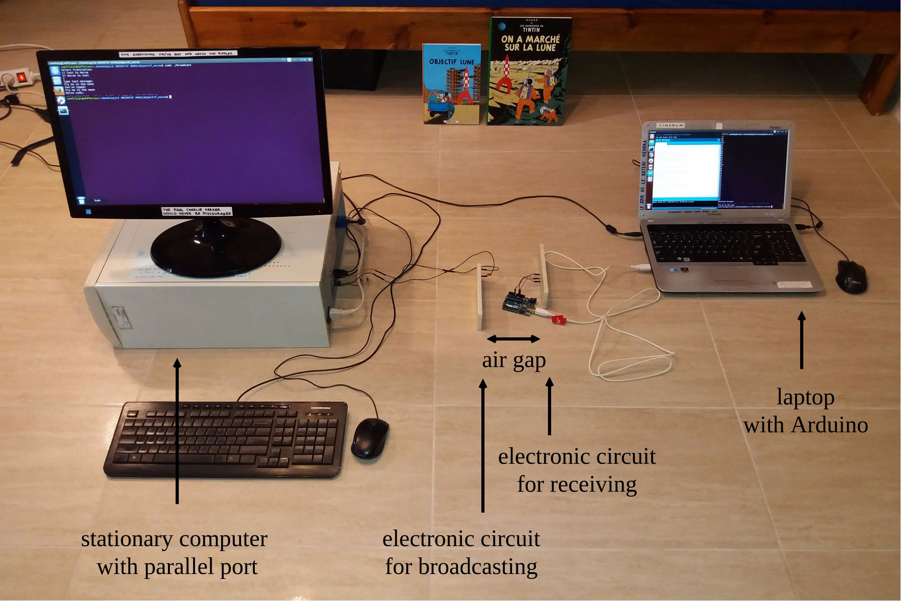

# The *Objectif Morse* project

Have you ever wondered what if there were two computers talking to each other using Morse code? One would send a message with light signals and the other would collect the light and understand the message? No cable connecting the computers. The information simply carried by light that travels through the air.

Well, here it is! In the *Objectif Morse* project you will make an interesting use of Arduino, electronic circuits and C++ while transmitting messages in Morse alphabet between computers.

Download this [**PDF tutorial**](https://github.com/camillejr/objectif_morse/raw/master/Documentation/Objectif_Morse.pdf) for the step by step project guide and enjoy the ride!

> *This work has been produced as part of the Arduino Study Group meetings at the Jagiellonian University.*

---------------------------------------------------------------------
